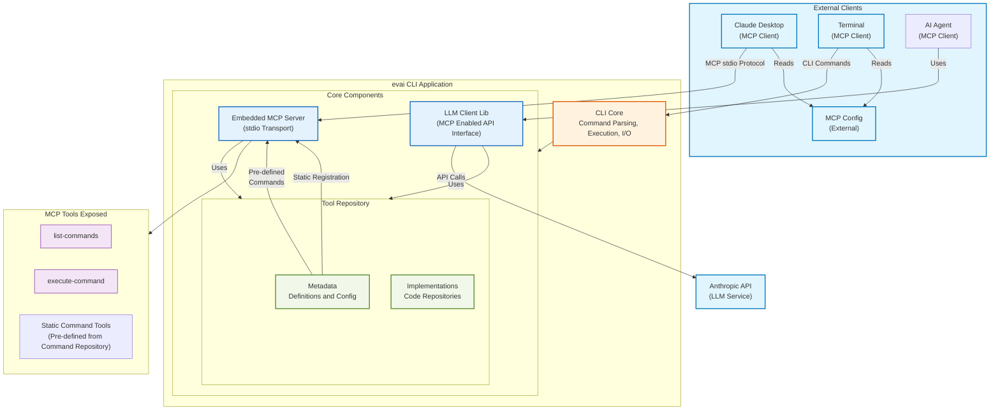

```mermaid
flowchart TB
    %% External Systems
    subgraph ExternalClients["External Clients"]
        Claude["Claude Desktop<br>(MCP Client)"]
	    MCPConfig["MCP Config<br>(External)"]
        Terminal["Terminal<br>(MCP Client)"]
        AIAgent["AI Agent<br>(MCP Client)"]
    end
    AnthropicAPI["Anthropic API<br>(LLM Service)"]
    
    %% Main evai CLI Application
    subgraph evai["evai CLI Application"]
        direction TB
        
        Core["CLI Core<br>Command Parsing, Execution, I/O"]
        
        subgraph Components["Core Components"]
            direction TB
            MCPServer["Embedded MCP Server<br>(stdio Transport)"]
            LLMClient["LLM Client Lib<br>(MCP Enabled API Interface)"]
            
            subgraph Storage["Tool Repository"]
                Commands["Metadata<br>Definitions and Config"]
                CodeStore["Implementations<br>Code Repositories"]
            end
            
            LLMClient -- "Uses" --> Storage
            MCPServer -- "Uses" --> Storage
            %% Indicate peer relationship by same level in hierarchy
        end
        
        Core --> Components
        
        %% Static command pathway
        Commands -- "Pre-defined<br>Commands" --> MCPServer
    end
    
    %% Relations/Connections
    Claude -- "MCP stdio Protocol" --> MCPServer
    Terminal -- "CLI Commands" --> Core
    LLMClient -- "API Calls" --> AnthropicAPI
    AIAgent -- "Uses" --> LLMClient
    Claude -- "Reads" --> MCPConfig
    Terminal -- "Reads" --> MCPConfig
    
    %% MCP Tools
    subgraph MCPTools["MCP Tools Exposed"]
        ListCommands["list-commands"]
        ExecuteCommand["execute-command"]
        StaticTools["Static Command Tools<br>(Pre-defined from Command Repository)"]
    end
    
    MCPServer --> MCPTools
    Commands -- "Static Registration" --> MCPServer
    
    classDef externalSystems fill:#e1f5fe,stroke:#0277bd,stroke-width:2px
    classDef evaiCore fill:#fff3e0,stroke:#e65100,stroke-width:2px
    classDef storage fill:#f1f8e9,stroke:#558b2f,stroke-width:2px
    classDef component fill:#e3f2fd,stroke:#1565c0,stroke-width:2px
    classDef tools fill:#f3e5f5,stroke:#7b1fa2,stroke-width:1px
    
    class Claude,Terminal,AnthropicAPI,MCPConfig,ExternalClients externalSystems
    class Core evaiCore
    class Commands,CodeStore storage
    class MCPServer,LLMClient component
    class ListCommands,ExecuteCommand tools
```
