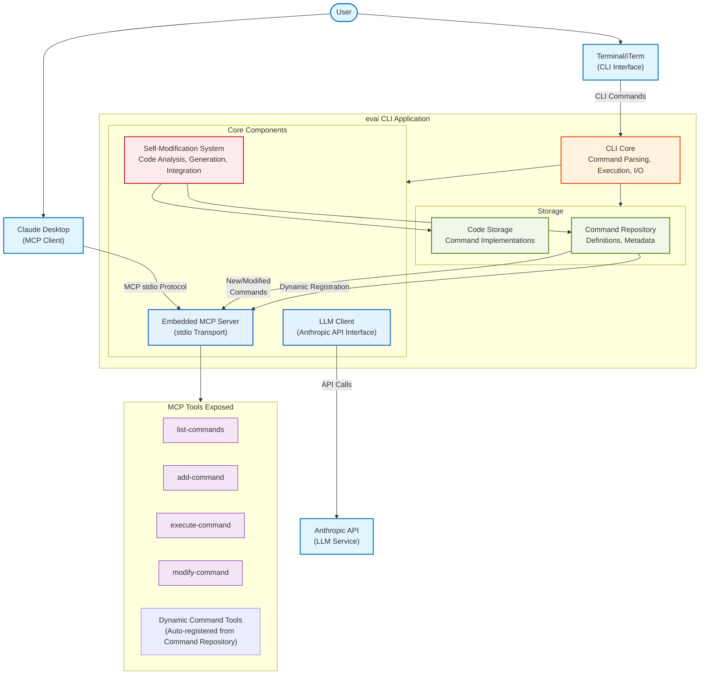

```mermaid

flowchart TB
    %% External Systems
    User([User])
    Claude["Claude Desktop\n(MCP Client)"]
    Terminal["Terminal/iTerm\n(CLI Interface)"]
    AnthropicAPI["Anthropic API\n(LLM Service)"]
    
    %% Main evai CLI Application
    subgraph evai["evai CLI Application"]
        direction TB
        
        Core["CLI Core\nCommand Parsing, Execution, I/O"]
        
        subgraph Components["Core Components"]
            direction LR
            MCPServer["Embedded MCP Server\n(stdio Transport)"]
            LLMClient["LLM Client\n(Anthropic API Interface)"]
            SelfMod["Self-Modification System\nCode Analysis, Generation, Integration"]
        end
        
        subgraph Storage["Storage"]
            Commands["Command Repository\nDefinitions, Metadata"]
            CodeStore["Code Storage\nCommand Implementations"]
        end
        
        Core --> Components
        Core --> Storage
        SelfMod --> CodeStore
        SelfMod --> Commands
        
        %% Dynamic tool registration pathway
        Commands -- "New/Modified\nCommands" --> MCPServer
    end
    
    %% Relations/Connections
    User --> Claude
    User --> Terminal
    Claude -- "MCP stdio Protocol" --> MCPServer
    Terminal -- "CLI Commands" --> Core
    LLMClient -- "API Calls" --> AnthropicAPI
    
    %% MCP Tools
    subgraph MCPTools["MCP Tools Exposed"]
        ListCommands["list-commands"]
        AddCommand["add-command"]
        ExecuteCommand["execute-command"]
        ModifyCommand["modify-command"]
        DynamicTools["Dynamic Command Tools\n(Auto-registered from Command Repository)"]
    end
    
    MCPServer --> MCPTools
    Commands -- "Dynamic Registration" --> MCPServer
    
    classDef externalSystems fill:#e1f5fe,stroke:#0277bd,stroke-width:2px
    classDef evaiCore fill:#fff3e0,stroke:#e65100,stroke-width:2px
    classDef storage fill:#f1f8e9,stroke:#558b2f,stroke-width:2px
    classDef selfMod fill:#ffebee,stroke:#c62828,stroke-width:2px
    classDef component fill:#e3f2fd,stroke:#1565c0,stroke-width:2px
    classDef tools fill:#f3e5f5,stroke:#7b1fa2,stroke-width:1px
    
    class User,Claude,Terminal,AnthropicAPI externalSystems
    class Core evaiCore
    class Commands,CodeStore storage
    class SelfMod selfMod
    class MCPServer,LLMClient component
    class ListCommands,AddCommand,ExecuteCommand,ModifyCommand tools
```